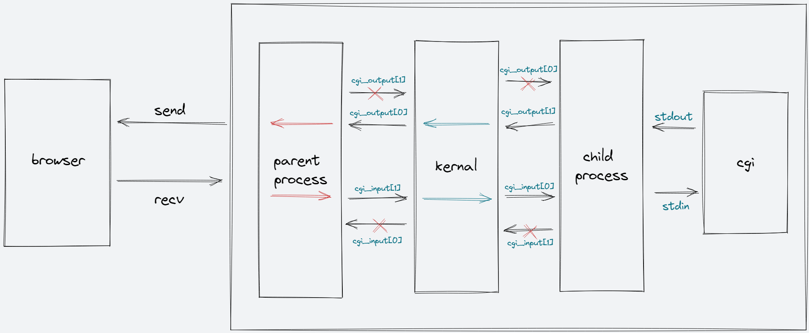

# 一款可运行基于C++11实现的HTTP服务器
## 1.简介
一款简单的轻量级服务器，主要内容：
- 实现快速地址再分配，避免紧急情况下服务器因启机而引起的服务失效；
- 实现get/post两种请求解析，采用cgi脚本进行post请求响应；
- 利用多线程机制提供服务，增加并行服务数量；
- 利用双管道进行不同进程间通信与数据交换，及时关闭无用管道。
## 2.编译
```bash
clang++ -o httpd.out -lpthread
```
    
## 3.整体框架图


